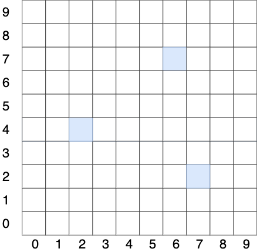

# Roll Rover Roll

After NASA’s New Horizon successfully flew past Pluto, they now plan to land a Pluto Rover to further investigate the surface. You are responsible for developing an API that will allow the Rover to move around the planet.

To simplify navigation, the planet has been divided up into a grid. 
The rover's position and location is represented by a combination of x and y coordinates and a letter representing one of the four cardinal compass points. An example position might be `0, 0, N` which means the rover is in the bottom left corner and facing North.

In order to control a rover, NASA sends a simple string of letters. The only commands you can give the rover are ‘F’,’B’,’L’ and ‘R
* Implement commands that move the rover forward/backward (‘F’,’B’). The rover may only move forward/backward by one grid point, and must maintain the same heading. As an example, rover at `0,0,N` will go to `0,1,N` with `F` command.
* Implement commands that turn the rover left/right (‘L’,’R’). These commands make the rover spin 90 degrees left or right respectively, without moving from its current spot. As an example, rover at `0,0,N` will go to `0,0,E` with `R` command.
* Implement wrapping from one edge of the grid to another. (Pluto is a sphere after all). An example is for a grid of 3x3 and rover at `0,0,W` it will move to `2,0,W` with `L` commmand.
* Implement obstacle detection before each move to a new square. If a given sequence of commands encounters an obstacle, the rover moves up to the last possible point and reports the obstacle

Here is an example:
* Let's say that the rover is located at 0,0 facing North on a 100x100 grid.
* Given the command "FFRFF" would put the rover at 2,2 facing East.
 
 

## Table of contents

- [Roll Rover Roll](#roll-rover-roll)
  - [Table of contents](#table-of-contents)
  - [Considerations](#considerations)
  - [Future Improvements](#future-improvements)

 

## Considerations
While the API has been developed, the following considerations were taken:
* The input commands from Nasa is a string delimeted by `,`. In other words, needs to respect this format `F,B,R,L,B,F,F,F`.
* The grid is set to be 10x10 in order to see the wrapping functionality in action.
* Obstacles are distributed as displayed bellow

## Future Improvements